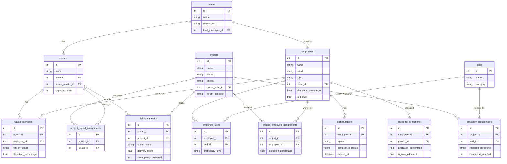

# Entity Relationship Diagram

```mermaid
erDiagram
    teams {
        int id PK
        string name
        string description
        int lead_employee_id FK
    }

    employees {
        int id PK
        string name
        string email
        string role
        int team_id FK
        float allocation_percentage
        bool is_active
    }

    squads {
        int id PK
        string name
        int team_id FK
        int scrum_master_id FK
        int capacity_points
    }

    squad_members {
        int id PK
        int squad_id FK
        int employee_id FK
        string role_in_squad
        float allocation_percentage
    }

    skills {
        int id PK
        string name
        string category
    }

    employee_skills {
        int id PK
        int employee_id FK
        int skill_id FK
        string proficiency_level
    }

    projects {
        int id PK
        string name
        string status
        string priority
        int owner_team_id FK
        string health_indicator
    }

    project_squad_assignments {
        int id PK
        int project_id FK
        int squad_id FK
    }

    project_employee_assignments {
        int id PK
        int project_id FK
        int employee_id FK
        float allocation_percentage
    }

    authorizations {
        int id PK
        int employee_id FK
        string system
        string compliance_status
        datetime expires_at
    }

    delivery_metrics {
        int id PK
        int squad_id FK
        int project_id FK
        string sprint_name
        float delivery_score
        int story_points_delivered
    }

    resource_allocations {
        int id PK
        int employee_id FK
        int project_id FK
        float allocation_percentage
        bool is_over_allocated
    }

    capability_requirements {
        int id PK
        int project_id FK
        int skill_id FK
        string required_proficiency
        int headcount_needed
    }

    teams ||--o{ squads : "has"
    teams ||--o{ employees : "employs"
    squads ||--o{ squad_members : "has"
    employees ||--o{ squad_members : "belongs_to"
    employees ||--o{ employee_skills : "has"
    skills ||--o{ employee_skills : "assigned_to"
    projects ||--o{ project_squad_assignments : "assigned"
    squads ||--o{ project_squad_assignments : "works_on"
    projects ||--o{ project_employee_assignments : "assigned"
    employees ||--o{ project_employee_assignments : "works_on"
    employees ||--o{ authorizations : "has"
    squads ||--o{ delivery_metrics : "records"
    projects ||--o{ delivery_metrics : "tracks"
    employees ||--o{ resource_allocations : "allocated"
    projects ||--o{ capability_requirements : "requires"
    skills ||--o{ capability_requirements : "needed_by"
```
